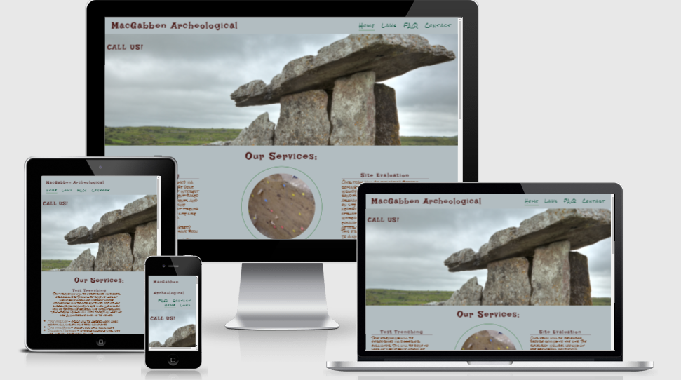

# Archeology Company Website

## User Stories:
- _First time Visitor Goals_
  - As a first time user of this site, I would like to be able to easily decifer the main purpose of the website and learn more about the company.
  - As a first time user, I would like to be able to easily navigate through the site to find content that I need and want to see.
  - As a first time user, I would like to be able to find information on the services of the company. 
  - As a first time user, I would like to be able to locate the social media links for the company to determine how trusted and known they are.
  - As a first time user, I would like to be able to look at Frequently Asked Questions and get some answers.

- _Returning Visitor Goals_
  - As a returning visitor, I would like to know the laws regarding archeology in Ireland.
  - As a returning visitor, I would like to know how to contact the company regarding pricing.

## Languages Used:

- _HTML_
- _CSS_

## Frameworks, Libraries & Programs Used:

- [Google Fonts](https://fonts.google.com/):_ used to import Irish Grover and Rock Salt into the style.css file which is used on all the pages of the project
- [Font Awesome](https://fontawesome.com/): used on all the pages of the website to add icons to make the page look astheticly pleasing
- [Git](https://git-scm.com): used to utilize the Gitpod terminal to commit to Git and Push to GitHub
- [GitHub](https://github.com/): used to store project code after being pushed from Git
- [Balsamiq](https://balsamiq.com/) Used to create the wire frame for the project during the planning phase
- [ColorSpace](https://mycolor.space) Used to help client choose colors that they preferred for website 
- [ImageColorPicker](https://imagecolorpicker.com/en/user/shared-palette?id=308363078299288132): Used to help client choose background colors for the website 
- [Am I Responsive?](http://ami.responsivedesign.is/)

- _W3C Markup Validator Results (No errors were returned when using Jigsaw validator)_- 
  - Home Page 
  - Laws Page 
  - FAQ Page 
  - Contact Page 

- _Jigsaw Validator Results(No errors were returned when using W3C validator)_
  - CSS Style Code Results 

- _Design:_
  - _Color Scheme:_ Brown and Green are the colors used on the project.  These were chosen by the client. They wanted earth tones since they are a archeology company.

- _Typography:_
  - Irish Grover and Rock salt are the fonts used in this website with cursive as a backup in case one of the fonts does not import correctly. The client wanted an Gaelic looking font.

- _Imagery:_

  - The main image for the website is important because it conveys the fact that it is an archeological company with a picture of an old structure that would be surveyed by the company. It is designed to get the users attention.  The additional imagery is to give an idea of what the company is doing when  Test Trenching,Site Evaluation, Geophysical Survey or doing Digital Archeology . This imagery was provided by the company and they provided me with the websites they used to find them. Hero-image came from stockvault.net. Archeology piscture used on contact us page background was from freeimages.com. The rest of the images came from publicdomainpictures.net. 

- _Balsamiq Wireframes:_

  - Home page wireframes at [this link](wireframes/home-page.pdf)
  - Laws Regarding Archeology Wirefram at [this link](wireframes/laws.pdf)
  - FAQ Wireframe at [this link](wireframes/faq.pdf)
  - Contact Wireframe at [this link](wireframes/contact-us.pdf)
## Features:

- _Responsive on all device sizes_

  - _Desktop_

    - 

  - _Tablet_

    - 

  - _Cell Phone_

    - 

- _Interactive Elements_

  - Home page has links to other pages for more information.

    - 

  - Laws Page with links that keep the user on webpage and open new tab to link.

    - 

  - Contact Page that allows the user to get a call back with more information on pricing etc.

    - 

  - FAQ Page with links that keep the user on webpage and open new tab to link.

    - 

  - Footer with contact information for social media, physical address and phone of company.

    - 

## Future Additions to page

- _Role of Archeologist Section_
- _Live google calander for booking services_
- _Ability to get map of archeology in a certain area._

## Testing User Stories from User Experience Section

- _First time Visitor Goals_

  - _As a first time user of this site, I would like to be able to easily decifer the main purpose of the website and learn more about the company._
  -- Upon entering of the site, users are able to easily see the company name and navigation bar. This way they can easily go to the page of their choice. Underneath is Our Hero Image of ? which gives them an idea of the archeology that could be surveyed by the company. Below that is more information about the services offered by this company.

    - 

  - _As a first time user, I would like to be able to easily navigate through the site to find content that I need and want to see._
  -- At the top of every page there is a navigation bar that is easily seen and accessible to the user. These links describe what they are about so the user can get more information about the company and why they may need to hire the company. There is also a contact us page that the user can use to contact the company to get someone to call back whether it is for more information or to start the process of hiring the company.

    - 

  - _As a first time user, I would like to be able to find information on the services of the company._ 
  -- The Home page has a listing of the services available and a description of what they are. Also listed are the different ways that you can be charged.  Those are hourly, daily and that discounts can be offered if more than one site is involved. The user can also go to bottom of Home page for the address and phone number of the company.

    - 

  - _As a first time user, I would like to be able to locate the social media links for the company to determine how trusted and known they are._
  -- The user can easily go to the bottom of the page and click onto one of the social media sites and open a new tab so that they stay on the website.

    - 

  - _As a first time user, I would like to be able to look at Frequently Asked Questions and get some answers._
  -- This is easily accesible on the FAQ page.  There are some basic questions and the answers that a lay person may have.  There is also a link to the Irish Statute Book as well as Europol that can be accessed while the user remains on the web page. These questions could be for a possible client, someone that found a piece of archeology or  someone who knows the whereabouts of stolen archeology.

    - 

- _Returning Visitor Goals:_ 

  - _As a returning visitor, I would like to know the laws regarding archeology in ireland._
  - - These are on the Laws Page of the website.  They are grouped according to region so the user can easily look at their region and view the law.  These links are able to be accessed while keeping the visitor on the website.

     - 

  - _As a returning visitor, I would like to know how to contact the company regarding pricing._ 
  - - This is on the Contact Us page.  The user is able to send their contact information for someone to call them back and give them more information and pricing.  This is also possible throught the social media sites. Also, the phone number and the address is listed on all the pages as well. This gives the user multiple points of contact for the company.

    - 

## Further Testing
  - The Website was tested on Google Chrome, Firefox, and Brave browsers.
  - The website was viewed on a variety of devices such as Desktop, Laptop, Samsung Galaxy Tablet and Samsung Galaxy 7, Samsung Galaxy 8, Samsung A12.
  - A large amount of testing was done to ensure that all of the pages were linking correctly. 
  - Friends and family members were asked to review the site and documentation to point out any bugs and/or user experience issues. I aso had my client test the website to see if it was what they wanted.

## Known Bugs
- _Wireframe doesn't load in firefox._
- _Hero Image has a gap on firefox while going all the way across on chrome and other platforms._

## Deployment

- The site was deployed to GitHub. I used the steps listed below to deploy. 
  - In the GitHub repository, go to the Settings tab 
  - Use the source section drop-down menu and select the Master Branch
  - Once the master branch has been selected, the page will be automatically refreshed with a detailed ribbon display to indicate the successful deployment. 

The live link can be found here - https://pattytonyoneill.github.io/archeology-company/

## Credits

### Code
- _Readme used sample readme from code institute as a model. [Github](https://github.com/Code-Institute-Solutions/readme-template/blob/master/README.md)_
- _The full screen hero image came from_

### Content
- _All content written by the developer._

### Media
- _Images came from_- Hero-image came from stockvault.net. Archeology picture used on contact us page background was from freeimages.com. The rest of the images came from publicdomainpictures.net.

### Acknowlegements
- _My Mentor for his help and feedback._
- _Tutor support at Code Institute_
- _Clients for their help with input on colors, logo and images that they wanted used on the webpage._
- _Family for help with help and feedback on website as a use_